# Robot Characterization Toolsuite

<!-- TOC -->

- [Robot Characterization Toolsuite](#robot-characterization-toolsuite)
  - [Included Characterization Tools](#included-characterization-tools)
  - [Prerequisites (PC)](#prerequisites-pc)
  - [Installing and launching the toolsuite](#installing-and-launching-the-toolsuite)
  - [Using the toolsuite](#using-the-toolsuite)
    - [Generating a project](#generating-a-project)
      - [Select project location](#select-project-location)
      - [Select project type](#select-project-type)
      - [Configure project parameters](#configure-project-parameters)
      - [Enter neam number](#enter-neam-number)
      - [Generate project](#generate-project)
    - [Deploying a project](#deploying-a-project)
      - [Option 1: Use the `Deploy Project` button](#option-1-use-the-deploy-project-button)
      - [Option 2: Deploy manually](#option-2-deploy-manually)
    - [Running the characterization routine](#running-the-characterization-routine)
      - [Launch the data logger](#launch-the-data-logger)
      - [Connect to robot](#connect-to-robot)
      - [Run tests](#run-tests)
    - [Analyzing data](#analyzing-data)
      - [Load your data file](#load-your-data-file)
      - [Run feedforward analysis](#run-feedforward-analysis)
      - [View diagnostics](#view-diagnostics)
        - [Time-domain diagnostics](#time-domain-diagnostics)
        - [Voltage-domain diagnostics](#voltage-domain-diagnostics)
        - [3D diagnostics](#3d-diagnostics)
      - [Feedback Analysis](#feedback-analysis)
        - [Set units](#set-units)
        - [Enter controller parameters](#enter-controller-parameters)
        - [Enter optimality constraints](#enter-optimality-constraints)
        - [Select loop type (drive only)](#select-loop-type-drive-only)
        - [Enter known kV/kA](#enter-known-kvka)
        - [Calculate gains](#calculate-gains)
  - [Contributing new changes](#contributing-new-changes)
  - [License](#license)
  - [Authors](#authors)

<!-- /TOC -->

This is a toolsuite for characterization of FRC robot mechanisms.  The characterization tools consist of a python application that runs on the user's PC, and matching robot code that runs on the user's robot.  The PC application will send control signals to the robot over network tables, while the robot sends data back to the application.  The application then processes the data and determines  characterization parameters for the user's robot mechanism, as well as producing diagnostic plots.  Data can be saved (in JSON format) for future use, if desired.

## Included Characterization Tools

The robot characterization toolsuite currently supports chracterization for:

- Drivetrains
- Arms
- Elevators

Feature requests for additional characterization tools are welcome.  Also note that many mechanisms can be characterized by simply adapting the existing code in this library.

## Prerequisites (PC)

To use the Robotpy Characterization Toolsuite, you must have Python (3.6 or higher) installed on your computer, as well as the standard WPILib tools for uploading a robot project:

* https://www.python.org/downloads/
* https://wpilib.screenstepslive.com/s/4485

## Installing and launching the toolsuite

To install the Robotpy Characterization Toolsuite, open a console and enter the following command:

`pip install robotpy-characterization`

The toolsuite, and all of its dependencies, should be automatically downloaded and installed.  If you are using a windows machine and the command `pip` is not recognized, ensure that [your python scripts folder has been added to the PATH](https://datatofish.com/add-python-to-windows-path/).

Once the toolsuite has been installed, launch a new drive characterization project to ensure that it works:

'robotpy-characterization drive new'

The new project GUI should open momentarily.  To launch other characterization projects, simply replace `drive` with the desired characterization type.

While the new project GUI has buttons for launching both the logging tool and the analyzer tool, these can also be launched directly from the CLI by replacing `new` with `logger` or `analyzer`.

For more information on CLI usage, enter `robotpy-characterization -h`.

## Using the toolsuite

### Generating a project

To use the toolsuite, we first need to generate a robot project.

#### Select project location

First, select the desired project location on the new project GUI:

#### Select project type

Next, select your project type from the drop-down menu:

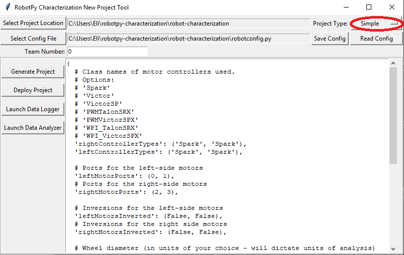

* 'Simple' projects use encoders plugged into the RIO's DIO ports, and measure voltage with the PDP.
* 'Talon' projects use encoders plugged into a Talon SRX, and measure voltage with the Talon.
* More project types may be added in the future.

#### Configure project parameters

In order to run on your robot, the tool must know some parameters about how your robot is set up.  Project config settings are formatted as a [Python dictionary literal](https://www.linuxtopia.org/online_books/programming_books/python_programming/python_ch15s02.html).  These can be modified via the in-window config editor:

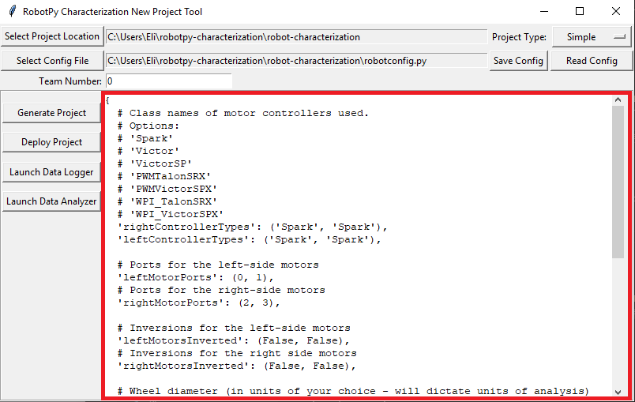

Take care of the following caveats when entering your robot specifications:

* The key names *must not be changed*, as they are hard-coded for each project type.  Only the values (i.e. the things on the right-hand side of the colons) should be modified.
* `True` and `False` *must* be capitalized, as they are evaluated as native Python.
* All string values (e.g. controller names and unit types) *must* be wrapped in quotes and *must* correspond exactly to one of the options described.
* All list values *must* be lists, even if they have only one element.  Do *not* omit trailing commas (e.g. in `(False,)`), as this will cause them not to be parsed as a list.

Once your robot configuration is set, you may save it to a location/name of your choice:

Accordingly, you can also load an existing config file (config files are project-type-specific!):

#### Enter neam number

Be sure to enter your team number in the team number field:

This is crucial to ensure your project will deploy to your robot successfully.  Note that the default team number of `0` corresponds to a localhost project, which will run locally using the WPILib robot simulator - this can be useful for ensuring that you have not made an error in your config file that results in code that does not build.

#### Generate project

Once your project has been configured, it's time to generate a deployable robot project to run the characterization:

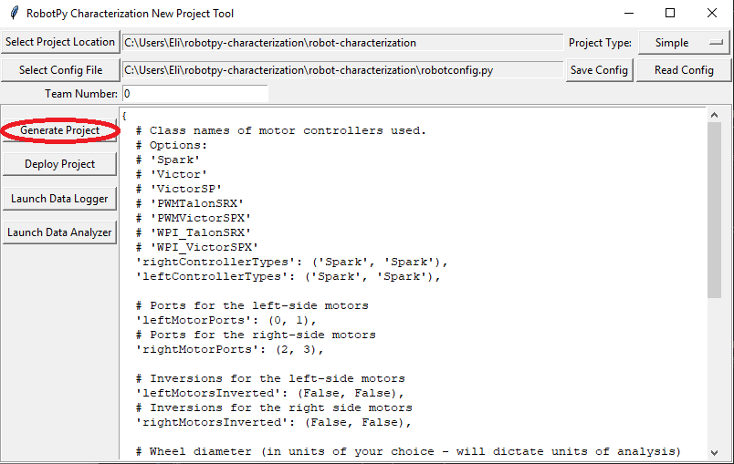

A generated robot project will be placed in a subfolder (named `characterization-project`) of your specified project location.

The generated robot code will be in Java, and will reflect the settings specified in your config file.  Advanced users are free to modify the generated code to their liking, if the existing configuration options do not suffice.

### Deploying a project

Once a project has been generated, it is time to deploy it to the robot.  This can be done in two ways:

#### Option 1: Use the `Deploy Project` button

Pressing the `Deploy Project` button on the GUI will attempt to use GradleRIO to deploy the project to your robot.  The GUI will *always* assume that the project is located in the `characterization-project` subfolder of the chosen project location.

Assuming a valid robot project is present at that location, a window should pop up displaying the Gradle output as the project builds and deploys:

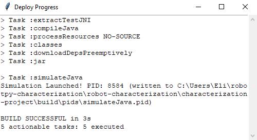

#### Option 2: Deploy manually

Since the generated project is a standard GradleRIO Java project, it can be deployed like any other.  Users may open the generated project in their editor of choice and deploy as they normally would any other robot project.  This can be convenient if customization of the generated code is required.

### Running the characterization routine

Once the characterization code has been deployed, we can now run the characterization routine, and record the resulting data for analysis.

NOTE:  Ensure you have sufficient space around the robot before running any characterization routine!  The drive characterization requires *at least* 10' of space, ideally closer to 20'.  The robot drive can *not* be accurately characterized while on blocks.

#### Launch the data logger

To launch the data logger, press the `Launch Data Logger` button:

This should open the data logger GUI:

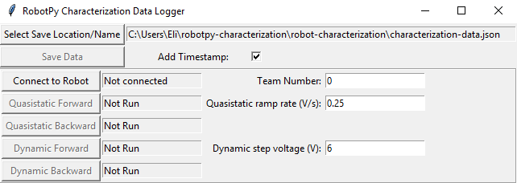

#### Connect to robot

Next, we must connect to the robot.  Press the `Connect to Robot` button.  The status indicated next to the button should change to `Connecting...` while the tool attempts to connect to the robot's NetworkTables server.

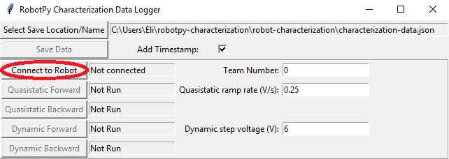

If the tool does not seem to be successfully connecting, try rebooting the robot.  Eventually, the status should change to `Connected`, indicating the tool is successfully communicating with the robot:

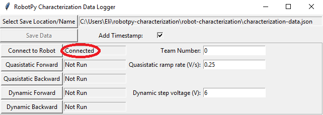

#### Run tests

A standard motor characterization routine consists of two types of tests:

* Quasistatic: In this test, the mechanism is gradually sped-up such that the voltage corresponding to acceleration is negligible (hence, "as if static").
* Dynamic: In this test, a constant 'step voltage' is given to the mechanism, so that the behavior while accelerating can be determined.

Each test type is run both forwards and backwards, for four tests in total, corresponding to the four buttons:

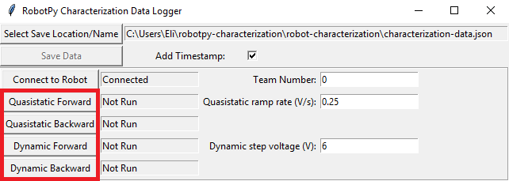

The tests can be run in any order, but running a "backwards" test directly after a "forwards" test is generally adviseable (as it will more or less reset the mechanism to its original position).

Follow the instructions in the pop-up windows after pressing each test button:

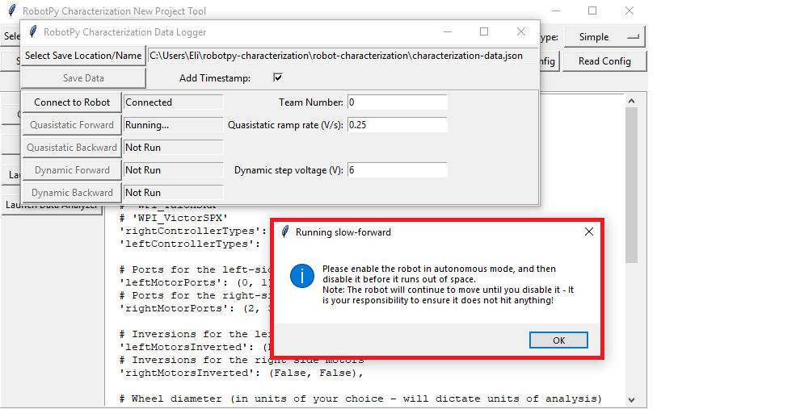

After all four tests have been completed, the `save` button will become activated:

This will save the data as a JSON file with the specified location/name.  A timestamp (`%Y%m%d-%H%M`) will be appended to the chosen filename if the "add timestamp" button is checked:

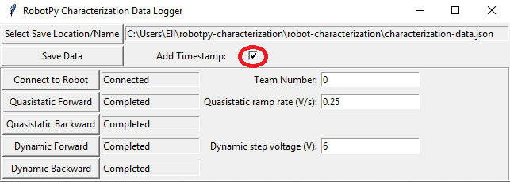

### Analyzing data

Once we have data from a characterization run, we can analyze it.  To launch the data analyzer, click on the `Launch Data Analyzer` button:

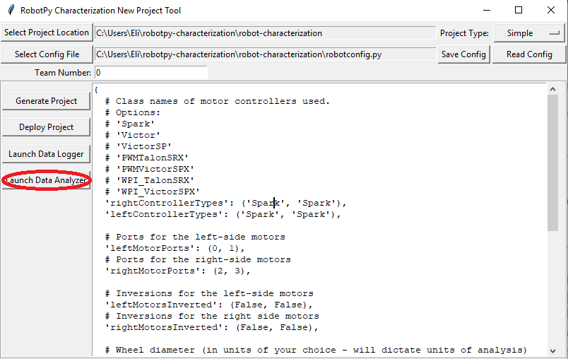

#### Load your data file

Now it's time to load the data file we saved from the logger tool.  Click on `Select Data File`:

In the resulting file dialog, select the JSON file you want to analyze.  If the file appears to be malformed, an error will be shown.

#### Run feedforward analysis

Once a data file has been selected, the `Analyze Data` button becomes available in the `Feedforwad Analysis` frame.  Click it.

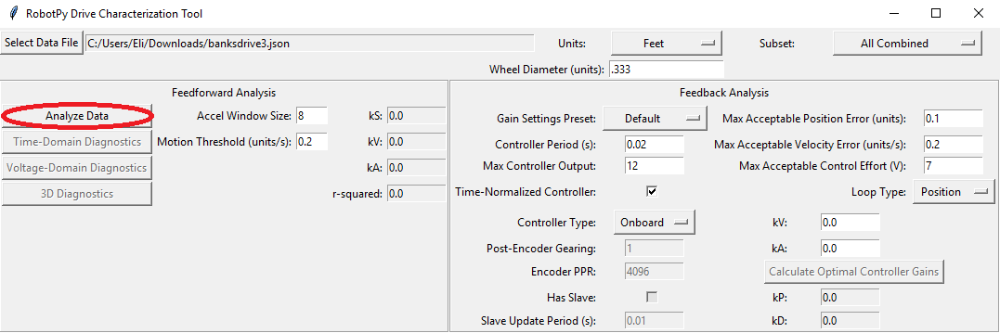

By default, the analysis will be run by combining all the data in the test.  For a finer-grained analysis, the analysis may be limited to a specific subset of data using the subset dropdown menu:

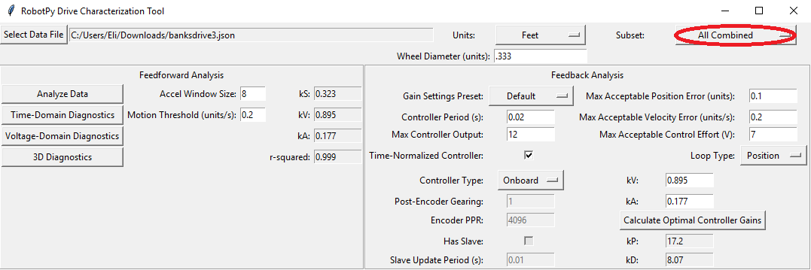

The computed coefficients of the mechanism characterization will then be filled in, along with a goodness-of-fit measure (r-squared):

The coefficients correspond to the characterization equation for each of the mechanism types:

* Drive: 
* Arm: 
* Elevator: &plus;kV\cdot\dot{d}&plus;kA\cdot\ddot{d})

#### View diagnostics

The first diagnostic to look at is the r-squared - it should be somewhere north of ~.9.  If it is significantly lower than this, there is likely a problem with your characterization data.

To investigate further, you can generate a number of diagnostic plots with the buttons on the left-hand side:

##### Time-domain diagnostics

The `Time-Domain Diagnostics` plots display velocity and acceleration versus time over the course of the analyzed tests.  For a typical drive characterization, these should look something like this (other mechanisms will be highly similar):

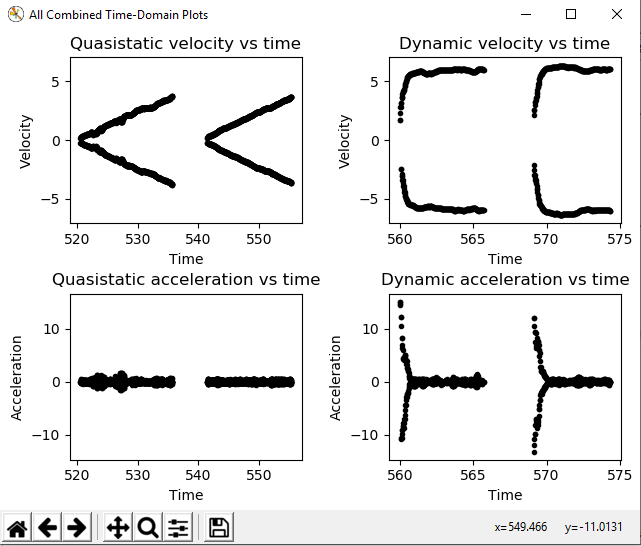

The vertical "mirroring" visible here is normal, and is simply the result of the left- and right-side encoders having different signs - this does not cause any trouble for the characterization tool.

The quasistatic test ought to have nearly linear velocity, and nearly-zero acceleration (hense "quasistatic").  The dynamic test ought to have velocity that asymptotically approaches a steady-state speed (the shape of the curve should be exponential, in fact), and acceleration that, accordingly, rapidly falls to zero (also exponentially, as the derivative of an exponential function is also an exponential function).

Deviation from this behavior is a sign of an error, either in your analysis settings or your test procedure.  In particular, a "flat" portion at the start of the the `Quasistatic velocity vs time` plot

indicates that the `Motion Threshold` setting is too low, and thus data points from before the robot begins to move are being included:

To solve this, increase the setting and re-analyze the data.

##### Voltage-domain diagnostics

The `Voltage-Domain Diagnostics` button plots velocity and acceleration versus voltage.  Velocity is ploted for the quasistatic test, and acceleration is plotted for the dynamic test.  For a typical drive characterization, the plots should resemble this (again, other mechanisms will be similar):

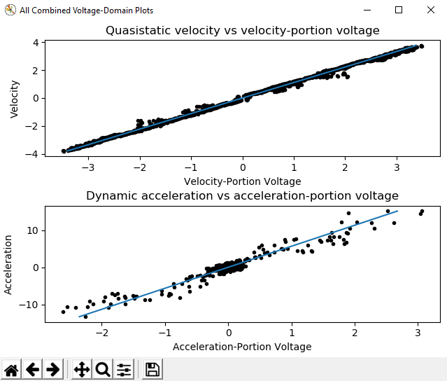

Both plots should be linear, however the dynamic plot will almost certainly have substantially-more noise.  The noise on the dynamic plot may be reduced by increasing the `Accel Window Size` setting:

However, if your robot or mechanism has low mass compared to the motor power, this may "eat" what little meaningful acceleration data you have (however, in these cases `kA` will tend towards zero and can usually be ignored, anyway).

Note that the x-axes corresponds to `velocity-portion voltage` and `acceleration-portion voltage`, respectively - as the governing voltage-balance equations are multi-dimensional, plots against raw voltage are not as useful as one might expect.

As before, an overly-small threshold setting may be seen as a flat "leading tail" on the quasistatic plot.

##### 3D diagnostics

The `3D Diagnostics` button will generate a 3d plot of voltage over the entire velocity-acceleration plane (this may be an adjusted voltage to remove the nonlinearity in mechanisms with nonlinear equations, such as arms):

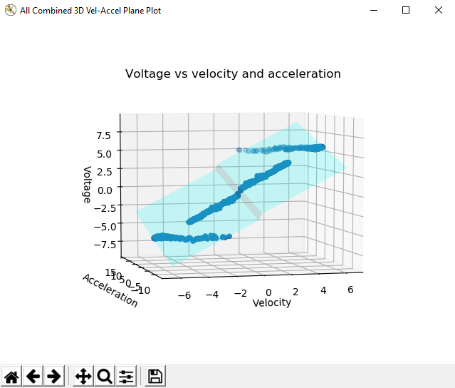

This plot is interactive, and may be rotated by clicking-and-dragging.  The quasistatic and dynamic tests should both be clearly visible as streaks of data, and the best fit-plane should pass through all the data points.  The data from both the quasistatic and dynamic tests should appear as straight lines (the reason for this is left as an exercise for the reader).

The discontinuity corresponds to `kS`, which always opposes the direction of motion and thus changes direction as the plot crosses the 0 velocity mark.

#### Feedback Analysis

Once the feedforward coefficients have been computed, the controls on the `Feedback Analysis` pane become available:

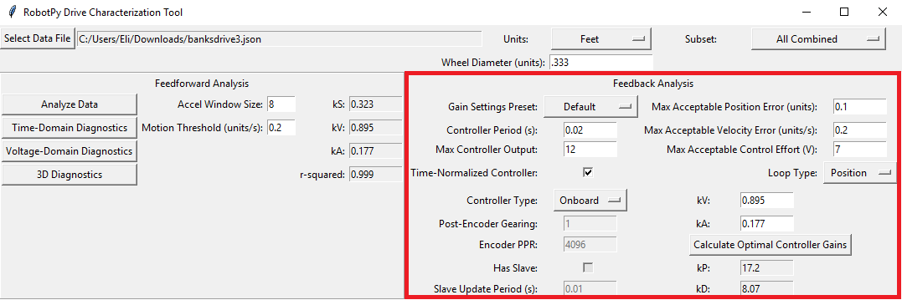

These can be used to calculate optimal gains for a PD or P controller for your mechanism.

Note that these gains are, in effect, "educated guesses" - they are not guaranteed to be perfect, and should be viewed as a "starting point" for further tuning.

##### Set units

Before using the `Feedback Analysis` pane, it is *crucial* that you set the `Units` settings to match the units of your data:

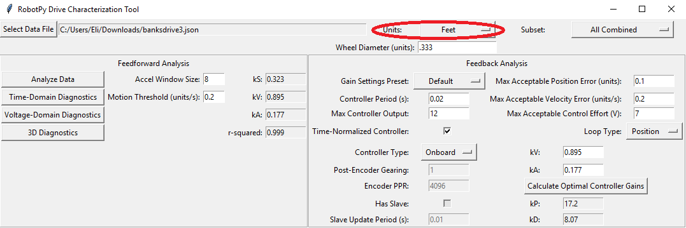

Additionally, if your choice of units requires a physical measurement (i.e. it is non-rotational), it is also important to specify the relevant mechanism dimension used for conversion:

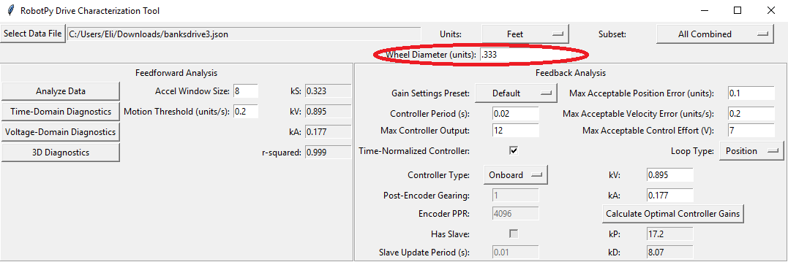

##### Enter controller parameters

The calculated feedforward gains are *dimensioned quantities*.  Unfortunately, not much attention is often paid to the units of PID gains in FRC controls, and so the various typical options for PID controller implementations differ in their unit conventions (which are often not made clear to the user).

To specify the correct settings for your PID controller, use the following options:

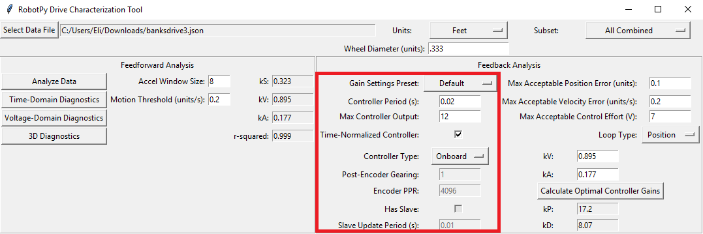

* `Gain Settings Preset`: This drop-down menu will auto-populate the remaining fields with likely settings for one of a number of common FRC controller setups.  Note that some settings, such as post-encoder gearing, PPR, and the presense of a slave motor must still be manually specified (as the analyzer has no way of knowing these without user input), and that others may vary from the given defaults depending on user setup.
* `Controller Period`: This is the execution period of the control loop, in seconds.  The default RIO loop rate is 50Hz, corresponding to a period of .02s.  The onboard controllers on most "smart controllers" run at 1Khz, or a period of .001s.
* `Max Controller Output`: This is the maximum value of the controller output, with respect to the PID calculation.  Most controllers calculate outputs with a maximum value of 1, but early versions of the Talon firmware have a maximum output of 1023.
* `Time-Normalized Controller`: This specifies whether the PID calculation is normalized to the period of execution, which affects the scaling of the D gain.
* `Controller Type`: This specifies whether the controller is an onboard RIO loop, or is running on a smart motor controller such as a Talon or a SPARK Max.
* `Post-Encoder Gearing`: This specifies the gearing between the encoder and the mechanism itself.  This is necessary for control loops that do not allow user-specified unit scaling in their PID computations (e.g. those running on Talons).  This will be disabled if not relevant.
* `Encoder PPR`: This specifies the pulses-per-revolution (*not* cycles per revolution) of the encoder used, which is needed in the same caes as `Post-Encoder Gearing`.
* `Has Slave`: Whether there is a motor controller slaved to the controller running the control loop, if the control loop is being run on a peripheral device.  This changes the effective loop period.
* `Slave Update Period`: The rate at which the slave (if present) is updated.  By default, this is 100Hz (ever .01s) for Talons and Sparks, but can be changed.

##### Enter optimality constraints

Finally, the user must specify some constraints for what will be considered an "optimal" controller:

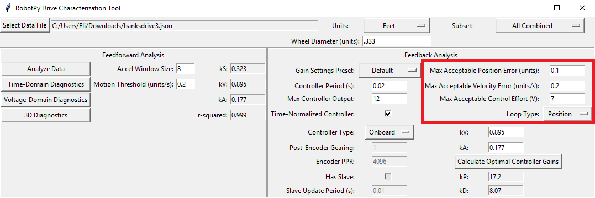

As a rule, smaller values for the `Max Acceptable Error` and larger values for the `Max Acceptable Control Effort` will result in larger gains - this will result in larger control efforts, which can grant better setpoint-tracking but may cause more violent behavior and greater wear on components.

The `Max Acceptable Control Effort` should never exceed 12V, as that corresponds to full battery voltage, and ideally should be somewhat lower than this.

##### Select loop type (drive only)

It is typical to control drives with both position and velocity PIDs, depending on application.  Either can be selected using the drop-down `Loop Type` menu:

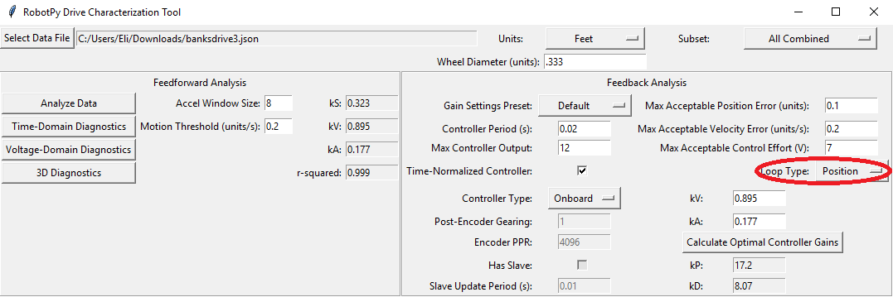

##### Enter known kV/kA

If one wishes to use the `Feedback Analysis` pane without running a full analysis on a set of data, or otherwise view the effect of modifying the `kV` and `kA` values, this can be done here:

##### Calculate gains

Finally, press the `Calculate Optimal Controller Gains` to run the LQR algorithm and determine the gains:

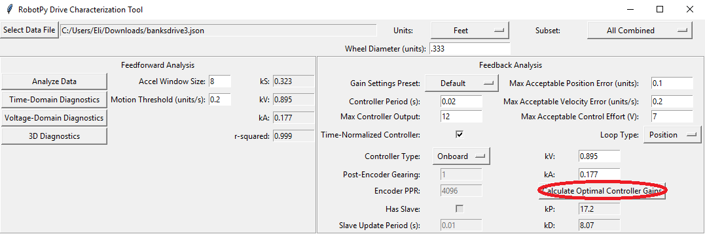

## Contributing new changes

This is intended to be a project that all members of the FIRST community can
quickly and easily contribute to. If you find a bug, or have an idea that you
think others can use:

1. [Fork this git repository](https://github.com/robotpy/robot-characterization/fork) to your github account
2. Create your feature branch (`git checkout -b my-new-feature`)
3. Commit your changes (`git commit -am 'Add some feature'`)
4. Push to the branch (`git push -u origin my-new-feature`)
5. Create new Pull Request on github

## License

All code in this repository is available under the Apache v2 license.

## Authors

Dustin Spicuzza (dustin@virtualroadside.com)

Eli Barnett (emichaelbarnett@gmail.com)
